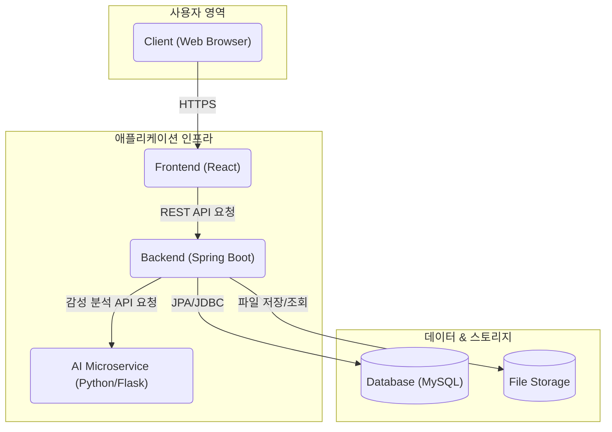
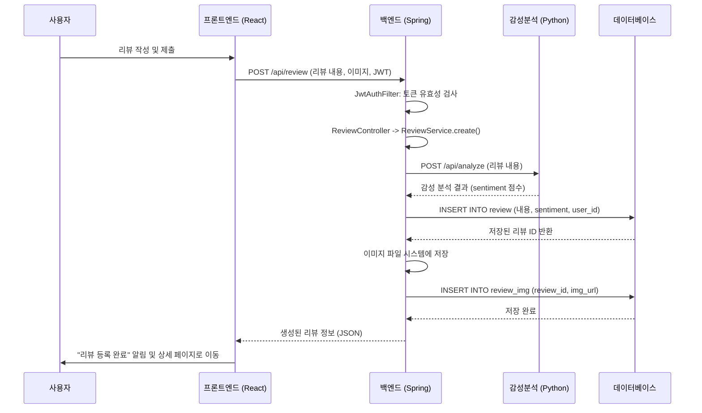
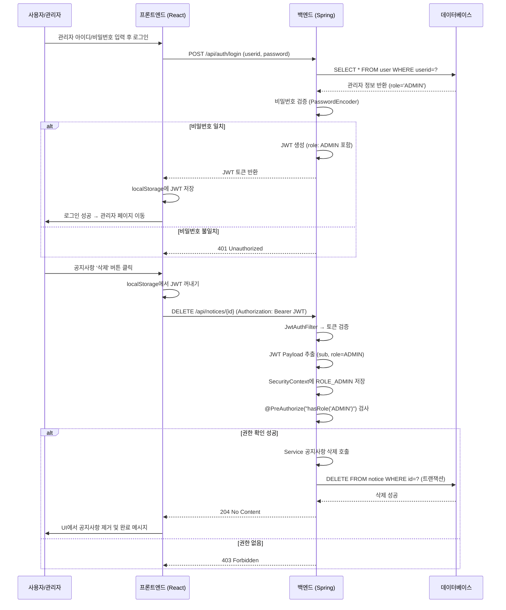

# On Your Mark

<br>

`ONYOURMARK`는 **러닝 전문 이커머스 플랫폼 [온유어마크(onyourmark-running.com)](https://onyourmark-running.com)을 클론**하여,
단순 이커머스 기능을 넘어 **커뮤니티 중심의 풀스택 플랫폼**으로 확장 및 재구현한 프로젝트입니다.  
사용자 중심의 동적인 웹 서비스를 제공하며, 안정적이고 확장 가능한 아키텍처 설계를 목표로 개발되었습니다.

<p align="center"></p>


<br>

## 📑 목차 (Table of Contents)

- [🎯 개발 포인트](#-개발-포인트)
- [🛠️ 기술 스택](#️-기술-스택)
- [🏛️ 시스템 아키텍처](#-시스템-아키텍처-system-architecture)
- [🌊 시퀀스 다이어그램](#-시퀀스-다이어그램-sequence-diagrams)
- [🔗 ERD](#-erd)
- [✨ 주요 기능](#-주요-기능)
- [📝 API 명세](#-api-명세)
- [🤯 트러블 슈팅](#-트러블-슈팅)
- [🖼️ 결과 화면](#-결과-화면)
- [📝 회고 & 배운 점](#-회고--배운-점)

<br>

## 🎯 개발 포인트

- **이커머스 핵심 기능과 커뮤니티 로직의 통합 설계**  
  원본 사이트의 이커머스 기능을 기반으로, 사용자가 직접 콘텐츠를 생성하고 상호작용할 수 있는 커뮤니티 로직을 통합 설계했습니다.

- **실제 서비스 수준의 아키텍처 설계 및 성능 최적화**  
  React와 Spring Boot를 사용하여 풀스택 아키텍처를 직접 설계·구축하고, 보안·성능·유지보수성을 고려한 구조를 적용했습니다.

- **AI 기술 융합**  
  원본 사이트에는 없는 차별화된 사용자 경험을 제공하기 위해, 리뷰 기능에 Python 마이크로서비스 기반 AI 감성 분석 모델을 연동했습니다.

- **안정적인 파일 업로드/이미지 관리**  
  범용 `FileService`를 구현해 파일 입출력 로직을 모듈화하고,  
  UUID 기반 파일명 생성 + 날짜별 폴더 구조로 충돌을 방지하며 관리 효율성을 높였습니다.

<br>

## 🛠️ 기술 스택

<div>
  
  
  
  
  
  
  
  
</div>

<br>

| 구분         | 기술                                                          |
| ------------ | ------------------------------------------------------------- |
| **Frontend** | React, Axios, React-Router, Redux Toolkit                     |
| **Backend**  | Java 17, Spring Boot, Spring Security, JPA(Hibernate), Gradle |
| **Database** | MySQL                                                         |
| **AI (ML)**  | Python, Flask, Hugging Face Transformers                      |
| **DevOps**   | Git                                                           |

<br>

## 🏛️ 시스템 아키텍처 (System Architecture)



<br>

## 🌊 시퀀스 다이어그램 (Sequence Diagrams)

### 1. 리뷰 게시판 + 감성 분석



### 2. JWT 인증 (관리자 공지사항 삭제 예시)



<br>

## 🔗 ERD

<p align="center"></p>


<br>

## ✨ 주요 기능

### 1. JWT 기반 인증 및 인가

- Spring Security를 커스터마이징하여 Stateless한 JWT(Access/Refresh Token) 기반 인증/인가 시스템을 구축했습니다.
- `OncePerRequestFilter`를 상속받은 `JwtAuthFilter`를 구현하여, 인증/인가 로직을 비즈니스 로직과 분리하고 코드의 재사용성과 유지보수성을 향상시켰습니다.

```java
// JwtAuthFilter.java
@Override
protected void doFilterInternal(HttpServletRequest request, HttpServletResponse response, FilterChain filterChain) throws ServletException, IOException {
    String token = jwtUtil.resolveToken(request);

    if(token != null && jwtUtil.validateToken(token)){
        String userid = jwtUtil.getUseridFromToken(token);
        String role = jwtUtil.getRoleFromToken(token);

        List<GrantedAuthority> authorities = (role != null && !role.isBlank())
                ? List.of(new SimpleGrantedAuthority("ROLE_" + role))
                : List.of();

        UsernamePasswordAuthenticationToken authentication =
                new UsernamePasswordAuthenticationToken(userid, null, authorities);

        SecurityContextHolder.getContext().setAuthentication(authentication);
    }

    filterChain.doFilter(request, response);
}
```

<br>

### 2. AI 감성 분석 기반 리뷰 (Hugging Face 연동)

- 사용자가 리뷰를 작성하면, 백엔드에서 Python(Flask)으로 구현된 AI 서버에 API 요청을 보내 리뷰 텍스트의 감성을 분석합니다.
- AI/ML 로직을 별도의 마이크로서비스로 분리하여, 각 서비스가 독립적으로 개발/배포/확장될 수 있는 유연한 구조를 설계했습니다.

```java
// ReviewService.java
private int analyzeSentiment(String content) {
    try {
        Map<String, String> request = Map.of("content", content);
        // Bean으로 등록된 RestTemplate과 @Value로 주입받은 URL 사용
        Map<String, Object> response = restTemplate.postForObject(flaskApiUrl, request, Map.class);

        if (response == null || !Objects.equals(response.get("status"), "success")) {
            throw new RuntimeException("Flask 감성분석에 실패했습니다.");
        }
        return (int) response.get("sentiment");
    } catch (Exception e) {
        throw new RuntimeException("감성 분석 서비스 호출에 실패했습니다.", e);
    }
}
```

<br>

### 3. 복합 비즈니스 로직을 처리하는 게시판

- 회원/비회원 모두 작성 가능하며, 비밀글 기능까지 포함된 게시판을 구현했습니다.
- Builder 패턴과 `@Transactional`을 적용하여 객체 생성의 안정성과 데이터의 정합성을 확보했습니다.

```java
// BoardService.java
@Transactional
public Long create(BoardPostCreateRequest request, String userid) {
    BoardPost.BoardPostBuilder b = BoardPost.builder()
            .title(request.getTitle())
            .content(request.getContent())
            .postPassword(passwordEncoder.encode(request.getPostPassword()))
            .isSecret(request.isSecret());

    if (userid != null) { // 회원
        User u = userRepository.findByUserid(userid).orElseThrow(() -> new RuntimeException("사용자가 존재하지 않습니다."));
        b.writerType(WriterType.MEMBER).member(u);
    } else { // 비회원
        if (request.getWriterName() == null || request.getWriterName().isBlank()) {
            throw new ResponseStatusException(HttpStatus.BAD_REQUEST, "작성자명을 입력해주세요.");
        }
        b.writerType(WriterType.GUEST).writerName(request.getWriterName());
    }
    return boardRepository.save(b.build()).getId();
}
```

<br>

### 4. 안정적인 파일 업로드

- 파일 입출력 로직을 `FileService`라는 범용 서비스로 분리하여 역할과 책임을 명확히 하고(SRP), 코드의 재사용성을 높였습니다.
- `UUID`를 이용해 파일명을 생성하여 이름 충돌을 방지하고, 날짜 기반으로 폴더를 생성하여 파일을 체계적으로 관리합니다.

```java
// ReviewImgService.java - 도메인 특화 서비스
public ReviewImg save(Review review, MultipartFile file) throws Exception {
    String oriImgName = file.getOriginalFilename();
    String today = LocalDate.now().format(DateTimeFormatter.ofPattern("yyyy/MM/dd"));
    String savePath = reviewImgLocation + "/" + today;

    // 범용 FileService에 파일 저장을 위임
    String saved = fileService.uploadFile(savePath, oriImgName, file.getBytes());

    ReviewImg img = ReviewImg.builder() ... .build();
    return reviewImgRepository.save(img);
}

// FileService.java - 범용 파일 저장 서비스
public String uploadFile(String uploadPath, String originalFileName, byte[] fileData) throws Exception {
    Path dir = Paths.get(uploadPath).toAbsolutePath().normalize();
    Files.createDirectories(dir);
    String saved = UUID.randomUUID() + "." + getExtension(originalFileName);
    Path target = dir.resolve(saved).normalize();
    Files.copy(new java.io.ByteArrayInputStream(fileData), target, StandardCopyOption.REPLACE_EXISTING);
    return saved;
}
```

<br>

## 📝 API 명세

👉 전체 API 문서는 [Postman Docs](https://documenter.getpostman.com/view/48241033/2sB3QFPrEj) 에서 확인할 수 있습니다.

| 구분       | 메서드 | 엔드포인트          | 설명                      |
| ---------- | ------ | ------------------- | ------------------------- |
| Auth       | POST   | /api/auth/login     | 로그인 (JWT 발급)         |
| Auth       | POST   | /api/auth/signup    | 회원가입                  |
| Members    | GET    | /api/members/member | 내 정보 조회              |
| Board(Q&A) | POST   | /api/board/new      | 게시글 작성               |
| Board(Q&A) | DELETE | /api/board/{id}     | 게시글 삭제               |
| Reposts    | POST   | /api/reposts/{id}   | 답변 작성 (관리자 전용)   |
| Notices    | GET    | /api/notices        | 공지사항 목록             |
| Notices    | DELETE | /api/notices/{id}   | 공지사항 삭제 (관리자)    |
| Review     | POST   | /api/review         | 리뷰 작성 (이미지 업로드) |


<br>

## 🤯 트러블 슈팅

### 1. 게시글 목록 조회 시 N+1 문제 발생

- **문제 상황:** 게시글 목록을 조회할 때, 각 게시글의 작성자 정보를 가져오기 위해 루프마다 추가적인 쿼리가 발생하는 N+1 문제를 발견했습니다. `p6spy`를 통해 확인 결과, 1개의 목록 조회 쿼리와 20개의 사용자 조회 쿼리(총 21개)가 실행되고 있었습니다.
- **해결 과정:** JPQL의 `JOIN FETCH`를 사용하여 게시글을 조회할 때 연관된 `User` 엔티티를 함께 가져오도록 수정했습니다. 이를 통해 즉시 로딩(Eager Loading)을 유도하여 단 한 번의 쿼리로 원하는 모든 데이터를 가져올 수 있었습니다.
- **결과:** 총 21개였던 쿼리가 **단 1개**로 감소했으며, API 응답 속도가 **약 50% 향상** (250ms → 120ms)되었습니다.

```java
// BoardRepository.java
@Query("SELECT b FROM BoardPost b JOIN FETCH b.member ORDER BY b.createdAt DESC")
List<BoardPost> findAllWithUser();
```

<br>

## 🖼️ 결과 화면

### 회원가입 & 로그인

- **회원가입** : 입력 → 완료 페이지  
- **로그인** : 입력 → 완료 알림  
- **회원정보 수정** : 비밀번호 확인 → 수정 페이지


<details> <summary>📂 전체 화면 더보기</summary>


</details>

<br>

### 리뷰 작성 + AI 감성 분석 결과

- 리뷰 작성 클릭 → 로그인 필요 알림 → 리뷰 작성 → 등록 완료  
- 등록 후 상세 페이지 (삭제 버튼은 로그인 시 작성자일 경우 노출)  
- 삭제 시 확인/완료 알림창


<details> <summary>📂 전체 화면 더보기</summary>


</details>

<br>

### Q&A 게시판 & 관리자 답변

- 사용자 문의 작성 (회원/비회원) → 상세 조회 → (비공개글) 비밀번호 확인 필요 / (관리자) 비공개글 관계없이 조회 가능  
- 마이페이지 → 내 문의 내역 확인 → 상세 조회  
- 관리자 답변 등록 → 수정


<details> <summary>📂 전체 화면 더보기</summary>


<br>


</details>

<br>

### 공지사항 (관리자 전용 CRUD)

- (관리자) 공지사항 등록 → 상세 페이지 → 수정 → 삭제
- (사용자) 공지사항 조회만 가능


<details> <summary>📂 전체 화면 더보기</summary>


</details>

<br>

## 📝 회고 & 배운 점

### 배운 점

- JWT 인증/인가와 Spring Security FilterChain 동작 원리를 실제로 이해하고 적용.

- 마이크로서비스 연동을 통해 독립 배포 가능한 AI 기능 구현 경험 확보.

- ERD → JPA 매핑 → N+1 트러블슈팅 과정을 통해 ORM 이해도 심화.

- Postman을 활용한 API 문서화와 공유까지 협업 친화적 문서 작성법 학습.

### 개선할 점

- 파일 업로드 로컬 저장 → AWS S3 등 클라우드 스토리지 전환 필요.

- AI 모델은 공개 Hugging Face 모델 사용 → 서비스 특화 파인튜닝 고려.

- 테스트 코드 커버리지가 낮음 → JUnit + MockMvc 기반 확대 예정.

- 배포 자동화(CI/CD) 및 Docker/K8s 기반 운영 환경 개선 필요.
