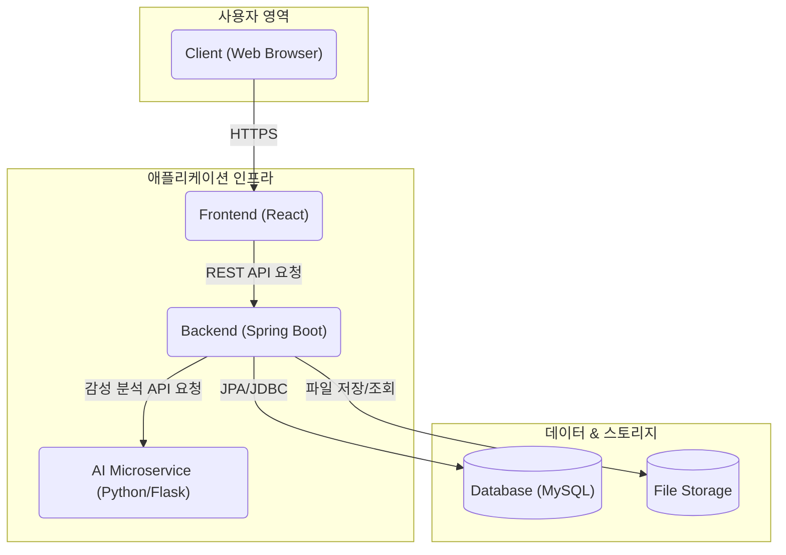
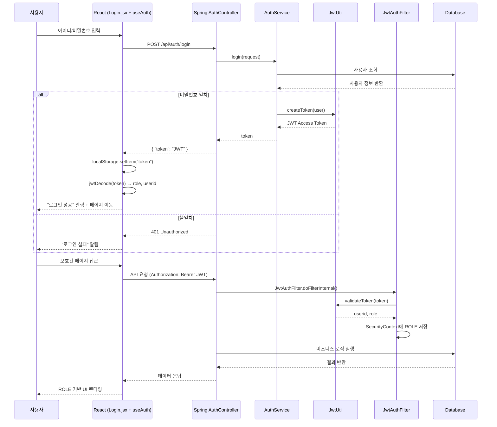
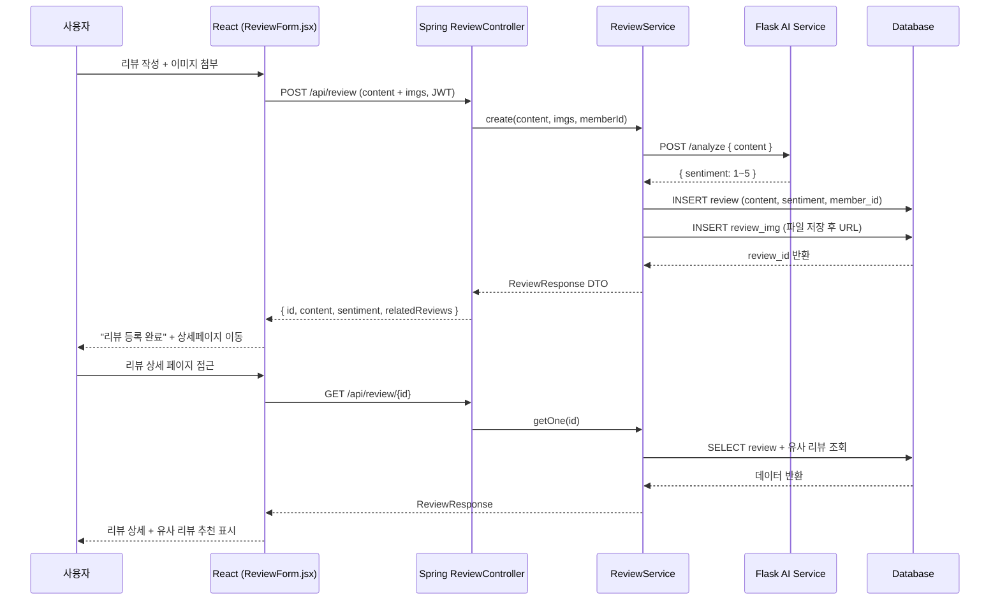
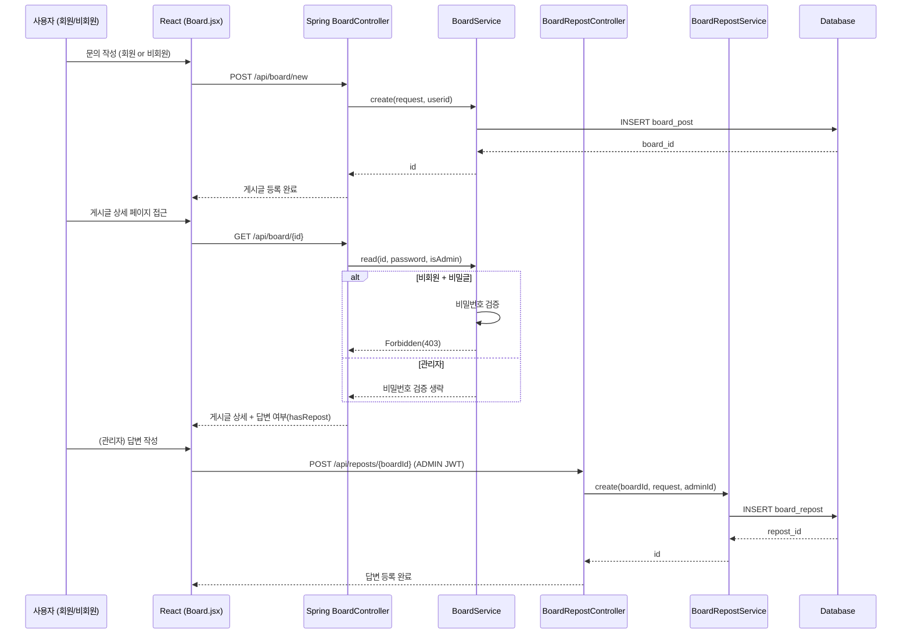
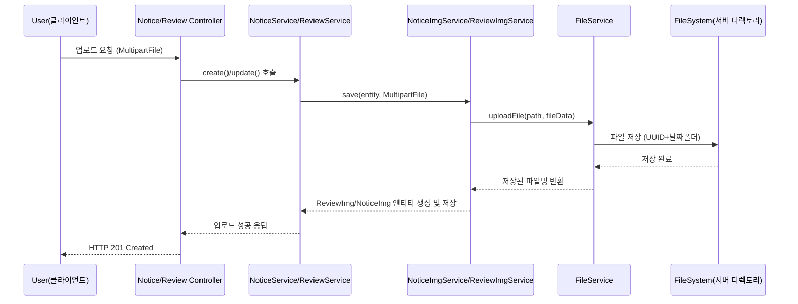

# On Your Mark

<br>

`ONYOURMARK`는 **러닝 전문 이커머스 플랫폼 [온유어마크(onyourmark-running.com)](https://onyourmark-running.com)을 클론**하여, **풀스택 플랫폼**으로 확장 및 재구현한 프로젝트입니다.  
사용자 중심의 동적인 웹 서비스를 제공하며, 안정적이고 확장 가능한 아키텍처 설계를 목표로 개발되었습니다.

<p align="center"></p>

<br>

## 📑 목차 (Table of Contents)

- [🎯 개발 포인트](#-개발-포인트)
- [🛠️ 기술 스택](#️-기술-스택)
- [🏛️ 시스템 아키텍처](#system-architecture)
- [🌊 시퀀스 다이어그램](#-시퀀스-다이어그램-sequence-diagrams)
- [🔗 ERD](#-erd)
- [📝 API 명세](#-api-명세)
- [✨ 주요 기능](#-주요-기능)
- [🤯 트러블 슈팅](#-트러블-슈팅)
- [🖼️ 결과 화면](#screenshots)
- [🚀 프로젝트 인사이트](#-프로젝트-인사이트)
- [📝 회고](#-회고)

<br>

## 🎯 개발 포인트

- **이커머스 핵심 기능과 커뮤니티 로직의 통합 설계**  
  원본 사이트의 이커머스 기능을 기반으로, 사용자가 직접 콘텐츠를 생성하고 상호작용할 수 있는 커뮤니티 로직을 통합 설계했습니다.

- **실제 서비스 수준의 아키텍처 설계 및 성능 최적화**  
  React와 Spring Boot를 사용하여 풀스택 아키텍처를 직접 설계·구축하고, 보안·성능·유지보수성을 고려한 구조를 적용했습니다.

- **AI 기술 융합**  
  원본 사이트에는 없는 차별화된 사용자 경험을 제공하기 위해, 리뷰 기능에 Python 마이크로서비스 기반 AI 감성 분석 모델을 연동했습니다.

- **안정적인 파일 업로드/이미지 관리**  
  범용 `FileService`를 구현해 파일 입출력 로직을 모듈화하고,  
  UUID 기반 파일명 생성 + 날짜별 폴더 구조로 충돌을 방지하며 관리 효율성을 높였습니다.

<br>

## 🛠️ 기술 스택

<div>
  
  
  
  
  
  
  
  
</div>

<br>

<div align="center">

| 구분         | 기술                                                          |
| ------------ | ------------------------------------------------------------- |
| **Frontend** | React, Axios, React-Router, Redux Toolkit                     |
| **Backend**  | Java 17, Spring Boot, Spring Security, JPA(Hibernate), Gradle |
| **Database** | MySQL                                                         |
| **AI (ML)**  | Python, Flask, Hugging Face Transformers                      |
| **DevOps**   | Git                                                           |

</div>

<br>

<a id="system-architecture"></a>
## 🏛️ 시스템 아키텍처 (System Architecture)



<br>

## 🌊 시퀀스 다이어그램 (Sequence Diagrams)

### 1. 🖇️ JWT 인증/인가



### 2. 🖇️ 리뷰 작성 & 분석



### 3. 🖇️ Q&A 게시판



### 4. 🖇️ FileUpload



<br>

## 🔗 ERD

📊 전체 테이블 구조는 [Google Sheets] https://docs.google.com/spreadsheets/d/1bTXc3KSDw5LSB-16UCVfFV8iHM6LN_cmsZGpj8ih0rE/edit?usp=sharing 에서 확인할 수 있습니다.

<p align="center"></p>

<br>

## 📝 API 명세

👉 전체 API 문서는 [Postman Docs](https://documenter.getpostman.com/view/48241033/2sB3QFPrEj) 에서 확인할 수 있습니다.

<div align="center">

| 구분       | 메서드 | 엔드포인트          | 설명                      |
| ---------- | ------ | ------------------- | ------------------------- |
| Auth       | POST   | /api/auth/login     | 로그인 (JWT 발급)         |
| Auth       | POST   | /api/auth/signup    | 회원가입                  |
| Members    | GET    | /api/members/member | 내 정보 조회              |
| Board(Q&A) | POST   | /api/board/new      | 게시글 작성               |
| Board(Q&A) | DELETE | /api/board/{id}     | 게시글 삭제               |
| Reposts    | POST   | /api/reposts/{id}   | 답변 작성 (관리자 전용)   |
| Notices    | GET    | /api/notices        | 공지사항 목록             |
| Notices    | DELETE | /api/notices/{id}   | 공지사항 삭제 (관리자)    |
| Review     | POST   | /api/review         | 리뷰 작성 (이미지 업로드) |

</div>

<br>

## ✨ 주요 기능

### 1. 🔑 JWT 기반 인증 및 인가

- **Stateless 인증 구조**
  - Spring Security + JWT를 활용해 **세션을 사용하지 않는 인증/인가 시스템**을 구현했습니다.
  - Access Token에는 `userid`, `username`, `memberId`, `role` 정보를 담아 발급하고, 만료 시간은 **1시간**으로 설정했습니다.

- **백엔드 인증 처리**
  - `AuthController` → 로그인 요청 처리 및 JWT 발급
  - `AuthService` → 사용자 검증 & 토큰 생성 로직
  - `JwtUtil` → JWT 생성/검증 및 Payload 추출
  - `JwtAuthFilter` → 매 요청마다 토큰 검증 후 `SecurityContext`에 인증 정보 저장

- **프론트엔드 인증 처리**
  - React `Login.jsx`에서 로그인 요청 → 응답 토큰을 `localStorage`에 저장
  - `jwtDecode`로 payload 파싱 후 `useAuth` 훅에서 상태 관리
  - ROLE에 따라 버튼(예: 관리자 전용)이나 페이지 접근 제어

<br>

```java
// JwtAuthFilter.java
@Override
    protected void doFilterInternal(HttpServletRequest request,
                                    HttpServletResponse response,
                                    FilterChain filterChain) throws ServletException, IOException {
        String token = jwtUtil.resolveToken(request);

        if(token != null && jwtUtil.validateToken(token)){
            String userid = jwtUtil.getUseridFromToken(token);
            String role = jwtUtil.getRoleFromToken(token);

            List<GrantedAuthority> authorities
                    = (role != null && !role.isBlank())
                    ? List.of(new SimpleGrantedAuthority("ROLE_" + role))
                    : List.of();

            System.out.println("Authorities set: " + authorities);

            UsernamePasswordAuthenticationToken authentication =
                    new UsernamePasswordAuthenticationToken(userid, null, authorities);

            authentication.setDetails(new WebAuthenticationDetailsSource().buildDetails(request));

            SecurityContextHolder.getContext().setAuthentication(authentication);
        }

        filterChain.doFilter(request, response);
    }
```

```java
// JwtUtil.java (발췌)
public String createToken(User user){
    Date now = new Date();
    Date expiryDate = new Date(now.getTime() + EXPIRATION_TIME);

    return Jwts.builder()
            .setSubject(user.getUserid())
            .claim("memberId", user.getId())
            .claim("username", user.getUsername())
            .claim("role", user.getRole().name())
            .setIssuedAt(now)
            .setExpiration(expiryDate)
            .signWith(key, SignatureAlgorithm.HS256)
            .compact();
}
```

```java
// useAuth.js (발췌)
const parseToken = () => {
  const token = localStorage.getItem("token");
  if (!token) return { token: null, role: null };

  const decoded = jwtDecode(token);
  if (decoded.exp * 1000 <= Date.now()) {
    localStorage.removeItem("token");
    return { token: null, role: null };
  }
  return { token, role: decoded.role };
};
```

<br>

---

### 2. 💡 AI 감성 분석 기반 리뷰 (Hugging Face 연동)

- **리뷰 작성 & 이미지 업로드**
  - React `ReviewForm`에서 작성자가 리뷰를 입력하고 이미지를 선택하면 `multipart/form-data`로 Spring 서버에 전송합니다.
  - 로그인하지 않은 사용자는 접근할 수 없으며, 작성자 본인만 삭제 버튼이 노출됩니다.

- **AI 감성 분석 (Flask)**
  - Spring `ReviewService`에서 Flask 서버의 `/analyze` API를 호출해 리뷰 텍스트의 감성 점수(sentiment)를 분석합니다.
  - Flask 서버는 Hugging Face 모델을 사용해 감성 분석을 수행하고, 결과를 JSON으로 반환합니다.

- **유사 리뷰 추천**
  - DB Native Query(`ReviewRepository.findSimilarReviews`)로 sentiment 값이 유사한 리뷰 5개를 조회하여 함께 응답합니다.
  - 프론트엔드에서는 `ReviewDetail` 화면 하단에 “다른 리뷰도 구경해보세요!” 섹션으로 표시됩니다.


```java
// ReviewService.java
private int analyzeSentiment(String content) {
    try {
        Map<String, String> request = Map.of("content", content);
        // Bean으로 등록된 RestTemplate과 @Value로 주입받은 URL 사용
        Map<String, Object> response = restTemplate.postForObject(flaskApiUrl, request, Map.class);

        if (response == null || !Objects.equals(response.get("status"), "success")) {
            throw new RuntimeException("Flask 감성분석에 실패했습니다.");
        }
        return (int) response.get("sentiment");
    } catch (Exception e) {
        throw new RuntimeException("감성 분석 서비스 호출에 실패했습니다.", e);
    }
}
```

```java
# Flask 서버 (app.py)
@app.route('/analyze', methods=['POST'])
def api_analyze():
    data = request.get_json()
    content = data.get("content", "").strip()
    sentiment = analyze_sentiment(content)
    return jsonify({"status": "success", "sentiment": sentiment})
```

```java
// ReviewForm.jsx (React)
const handleSubmit = async (e) => {
  e.preventDefault();
  const formData = new FormData();
  formData.append("content", content);
  imgs.forEach(img => formData.append("imgs", img));

  const res = await api.post("/api/review", formData, {
    headers: { "Content-Type": "multipart/form-data", Authorization: `Bearer ${auth.token}` },
  });

  alert("리뷰가 등록되었습니다.");
  navigate(`/review/${res.data.id}`);
};
```

<br>

---

### 3. 📝 복합 비즈니스 로직을 처리하는 Q&A 게시판 (회원/비회원 작성 + 관리자 답변)

- **회원/비회원 작성 지원**
  - 회원: 로그인 후 바로 작성 가능
  - 비회원: 작성자명 + 비밀번호 입력 필수
  - 작성 시 **비공개 설정** 가능 → 비밀번호 입력해야 조회 가능

- **권한 기반 접근 제어**
  - 본인(회원/비회원) 또는 관리자만 수정/삭제 가능
  - 비공개 글은 작성자 비밀번호 검증 필요
  - 관리자는 ROLE 확인 후 모든 글 접근 가능

- **관리자 답변**
  - `@PreAuthorize("hasRole('ADMIN')")` 기반으로 관리자만 답변 CRUD 가능
  - 게시글당 답변은 1개만 등록 가능 (중복 방지)

```java
// BoardService.java - 게시글 작성
  public Long create(BoardPostCreateRequest request, String userid){
        BoardPost.BoardPostBuilder b = BoardPost.builder()
                .title(request.getTitle())
                .content(request.getContent())
                .postPassword(passwordEncoder.encode(request.getPostPassword()))
                .isSecret(request.isSecret());

        if(userid != null){
            User u = userRepository.findByUserid(userid)
                    .orElseThrow(() -> new RuntimeException("사용자가 존재하지 않습니다."));
            b.writerType(WriterType.MEMBER).member(u).writerName(null);
        }else {
            if(request.getWriterName() == null || request.getWriterName().isBlank()){
                throw new ResponseStatusException(HttpStatus.BAD_REQUEST, "작성자명을 입력해주세요.");
            }

            b.writerType(WriterType.GUEST).writerName(request.getWriterName()).member(null);
        }

        return boardRepository.save(b.build()).getId();
    }
```

```java
// BoardRepostController.java - 관리자 답변 작성
@PreAuthorize("hasRole('ADMIN')")
@PostMapping("/{boardId}")
public ResponseEntity<Long> create(
  @PathVariable Long boardId,
  @RequestBody BoardRepostCreateRequest request,
  Authentication authentication
){
        String userid = authentication.getName();
        Long id = repostService.create(boardId, request, userid);

        return ResponseEntity.ok(id);
    }
```

<details>
  <summary><b>💻 프론트엔드 (React Q&A 게시판) (클릭)</b></summary>
  
  Q&A 게시판은 React 컴포넌트 단위(BoardPage.jsx)로 구성되어 있으며, **회원/비회원 작성, 비밀번호 검증, 관리자 답변 작성**까지 모두 지원합니다.

  #### 1) 📋 게시판 목록 (BoardMain.jsx)

  - 서버에서 게시글 리스트를 불러오고 페이지네이션을 적용했습니다.
  - **비밀글 🔒 아이콘 표시**, **관리자 답변 상태(대기/완료)** 표시 기능이 있습니다.

  ```jsx
  const fetchBoardList = async (page = 0) => {
    const response = await api.get(`/api/board?page=${page}&size=20&sort=createdAt,desc`);
    setBoardList(response.data.content || []);
  };
  ```

#### 2) ✍️ 게시글 작성 / 수정 (BoardWriteUser.jsx)
- 회원: 로그인 상태에서 바로 작성 가능
- 비회원: 작성자명 + 비밀번호 필수 입력
- 수정 모드: 기존 비밀번호 확인 후 수정 가능

```java
const createPost = async () => {
    try {
      const body = {
        title: formData.title,
        content: formData.content,
        writerName: formData.writerName, // 항상 전송
        postPassword: createPassword,
        isSecret: formData.isSecret,
      };
      const res = await api.post("/api/board/new", body);
      return res.data;
    } catch (err) {
      throw new Error(
        err.response?.data?.message ||
          err.message ||
          "게시글 작성 중 오류가 발생했습니다."
      );
    }
  };
```

#### 3) 🔑 비밀글 접근 (BoardPassword.jsx)
- 비회원이 작성한 비밀글 접근 시 비밀번호 입력 창을 노출
- 입력값 검증 후, 서버로 API 요청 → 성공 시 상세조회 가능

```java
const handlePasswordSubmit = async (e) => {
    e.preventDefault();
    if (!password.trim()) return setError("비밀번호를 입력해주세요.");
    try {
      setLoading(true);
      setError("");
      const res = await api.get(`/api/board/${post.id}`, {
        params: { password },
      });
      onPasswordSuccess({ ...res.data, password }); // 상세/수정 재호출에 사용
    } catch (err) {
      if (err.response?.status === 403)
        setError("비밀번호가 일치하지 않습니다.");
      else if (err.response?.status === 404)
        setError("게시글을 찾을 수 없습니다.");
      else
        setError(
          err.response?.data?.message || err.message || "오류가 발생했습니다."
        );
    } finally {
      setLoading(false);
    }
  };
```

#### 4) 📖 게시글 상세 (BoardDetail.jsx)
- 제목, 작성자(마스킹), 작성일, 조회수 등 메타 정보 표시
- 본인(또는 관리자)만 수정/삭제 버튼 노출
- 관리자 답변 영역 연동

```java
// 게시글 상세 조회
  const fetchPostDetail = async (id, password = null) => {
    try {
      setLoading(true);
      const params = password ? { password } : {};
      const response = await api.get(`/api/board/${id}`, { params });
      const data = response.data;
      setPostData(data);
      setError(null);
    } catch (err) {
      if (err.response?.status === 403) {
        setError("비밀번호가 일치하지 않습니다.");
      } else if (err.response?.status === 404) {
        setError("게시글을 찾을 수 없습니다.");
      } else {
        setError(
          err.response?.data?.message ||
            err.message ||
            "게시글을 불러오는데 실패했습니다."
        );
      }
    } finally {
      setLoading(false);
    }
  };
```

```java
// 답변 조회
  const fetchRepost = async () => {
    try {
      const res = await api.get(`/api/reposts/${post.id}`);
      setRepostData(res.data);
    } catch (err) {
      setRepostData(null);
    }
  };
```

#### 5) 🛠 관리자 답변 작성 / 수정 (BoardRepostWrite.jsx)
- ADMIN 권한 계정만 접근 가능
- 답변 작성/수정 API 연동

```java
  const handleSubmit = async () => {
    if (!content.trim()) {
      alert("답변 내용을 입력하세요.");
      return;
    }
    try {
      setLoading(true);
      if (mode === "create") {
        await api.post(`/api/reposts/${post.id}`, { content });
        alert("답변이 등록되었습니다.");
      } else {
        await api.put(`/api/reposts/${post.id}`, { content });
        alert("답변이 수정되었습니다.");
      }
      onSuccess();
    } catch (err) {
      alert(err.response?.data?.message || err.message || "오류 발생");
    } finally {
      setLoading(false);
    }
  };
```

#### 6) 📌 페이지 전체 흐름 (BoardPage.jsx)
list → detail → write/edit → repostWrite/edit → password 모드로 전환, 각 상태에 따라 컴포넌트 렌더링 제어

```java
{mode === "list" && <BoardMain onPostSelect={handlePostSelect} />}
{mode === "password" && <BoardPassword post={selectedPost} />}
{mode === "detail" && <BoardDetail post={selectedPost} />}
{mode === "write" && <BoardWriteUser mode="write" />}
{mode === "edit" && <BoardWriteUser mode="edit" post={selectedPost} />}
```
</details>

<br>

---

### 4. 📂 파일 업로드 공통 처리

- 파일 업로드는 **공지사항(Notice) / 리뷰(Review)** 에서 공통적으로 사용되며, `FileService`라는 범용 서비스로 **파일 저장 책임을 분리**하여 코드 중복을 제거했습니다. 
  - `UUID`를 이용한 안전한 파일명 생성 → 이름 충돌 방지  
  - `yyyy/MM/dd` 형식의 날짜 기반 디렉토리 생성 → 체계적인 파일 관리  
  - 서비스 단(`NoticeImgService`, `ReviewImgService`)에서는 **DB 엔티티 저장만 담당** 으로 역할 분리

```java
// FileService.java - 범용 파일 저장 서비스
public String uploadFile(String uploadPath, String originalFileName, byte[] fileData)
        throws Exception {

        Path dir = Paths.get(uploadPath).toAbsolutePath().normalize();
        Files.createDirectories(dir);

        String safeName = Objects.toString(originalFileName, "");
        String ext = "";
        int dot = safeName.lastIndexOf('.');
        if (dot > -1 && dot < safeName.length() - 1) {
            ext = safeName.substring(dot).toLowerCase(); // ".jpg"
        }

        String saved = UUID.randomUUID() + ext;
        Path target = dir.resolve(saved).normalize();

        try (InputStream in = new java.io.ByteArrayInputStream(fileData)) {
            Files.copy(in, target, StandardCopyOption.REPLACE_EXISTING);
        }

        log.info("파일 저장: {} -> {}", originalFileName, target);
        return saved;
    }
```

<br>


## 🤯 트러블 슈팅

### 1. 게시글 목록 조회 시 N+1 문제 발생

#### 👉 JPA Fetch 전략 최적화로 쿼리 성능 개선

- **문제 상황**

  - 게시글(`BoardPost`) 목록 조회 시, 연관된 작성자(`User`) 정보를 지연 로딩(LAZY)으로 가져오면서 불필요한 N개의 추가 쿼리가 발생하는 N+1 문제를 발견했습니다.
  - API를 호출하면 아래와 같이 게시글 목록을 조회하는 쿼리 1개 실행 후, 각 게시글의 작성자 정보를 조회하는 N개의 쿼리가 추가로 발생하는 것을 로그로 확인했습니다.

<details>
<summary><b>AS-IS: 실행 쿼리 로그 확인하기 (클릭)</b></summary>

```sql
-- 1. 게시글 목록 조회 (쿼리 1번)
Hibernate: 
    select ... from board_post bp1_0 order by bp1_0.created_at desc limit ?, ?

-- 2. 각 게시글의 작성자(User) 정보를 개별적으로 조회 (쿼리 N번)
Hibernate: 
    select ... from users u1_0 where u1_0.member_id=?
Hibernate: 
    select ... from users u1_0 where u1_0.member_id=?
-- (게시글 수만큼 반복)
```

</details>

- **해결 과정**

  - JPQL `JOIN FETCH`를 적용하여 `BoardPost`와 연관된 `User` 엔티티를 **한 번의 `JOIN` 쿼리**로 함께 조회하도록 리팩토링했습니다.
  - 페이징 처리를 위해 `countQuery`를 별도로 분리하여, 데이터 조회와 전체 개수 계산 로직을 모두 최적화했습니다.

- **결과**

  - **(N+1)번 실행되던 쿼리를 단 2번(데이터 조회 1번, Count 1번)으로 최적화**하여 DB 부하를 크게 감소시켰습니다.
  - API 평균 응답 속도가 **약 52% 개선 (250ms → 120ms)**.
  - ORM Fetch 전략 및 성능 병목 구간 최적화 역량을 확보했습니다.

<details>
<summary><b>TO-BE: 최적화된 쿼리 로그 확인하기 (클릭)</b></summary>

```sql
-- 1. 게시글과 작성자 정보를 JOIN하여 한 번에 조회 (쿼리 1번)
Hibernate: 
    select ..., m1_0.member_id, m1_0.email, ... 
    from board_post bp1_0 
    join users m1_0 on m1_0.member_id=bp1_0.member_id 
    order by bp1_0.created_at desc limit ?

-- 2. 페이징을 위한 전체 개수 조회 (쿼리 1번)
Hibernate: 
    select count(bp1_0.board_id) from board_post bp1_0
```

</details>

```java
// BoardRepository.java
@Query(value = "SELECT b FROM BoardPost b JOIN FETCH b.member",
       countQuery = "SELECT count(b) FROM BoardPost b")
Page<BoardPost> findAllWithUser(Pageable pageable);
```

---

### 2. 유사 리뷰 추천 기능의 비효율적인 아키텍처

#### 👉 Native Query 기반으로 데이터 계층에서 직접 처리

- **문제 상황**

  - 리뷰 추천 로직이 AI 서버(Flask)에 과도하게 의존.
  - 불필요한 API 호출 + 대량 데이터 전송으로 네트워크 지연 및 메모리 부하 발생.

- **해결 과정**

  - 추천 로직(유사도 계산 + 정렬 + 개수 제한)을 DB Native Query로 재구현.
  - 모든 연산을 DB에서 처리하고, 애플리케이션은 최종 결과만 수신하도록 아키텍처 개선.

- **결과**

  - 불필요한 외부 API 호출 제거 → AI 서버 장애/지연의 영향 최소화.
  - 복잡한 연산을 DB로 위임하여 서버 자원(CPU·메모리) 최적화.
  - 책임과 역할을 계층별로 분리, 안정성과 성능 모두 개선.
  - 시스템의 비효율을 아키텍처 관점에서 진단하고, 책임과 역할의 재분배를 통해 성능을 개선하는 역량 확보

```java
// ReviewRepository.java
@Query(value = "SELECT * FROM review r " +
               "WHERE r.review_id != :reviewId AND ABS(r.sentiment - :sentiment) <= 1 " +
               "ORDER BY ABS(r.sentiment - :sentiment) ASC, r.created_at DESC " +
               "LIMIT 5", nativeQuery = true)
List<Review> findSimilarReviews(@Param("sentiment") int sentiment,
                                @Param("reviewId") Long reviewId);
```

---

### 3. Spring Security 인증/인가 문제

#### 👉 FilterChain 재구성과 권한(Role) 매핑 수정

- **문제 상황**

  - JWT 토큰이 정상 발급되었음에도 일부 API 요청에서 `403 Forbidden` 발생.
  - 사용자 권한(Role)에 따른 접근 제어가 기대와 다르게 동작.

- **해결 과정**

  - `JwtAuthFilter`를 `UsernamePasswordAuthenticationFilter` 앞에 등록하여 토큰 검증 순서 보장.
  - `requestMatchers()`로 엔드포인트별 권한을 명확히 재정의.

- **결과**

  - 인증/인가 로직이 정상적으로 동작하며, 역할(Role) 기반 접근 제어 확립.
  - Spring Security FilterChain의 실행 순서와 커스터마이징 방법에 대한 깊은 이해 확보.

```java
@Bean
public SecurityFilterChain securityFilterChain(HttpSecurity http) throws Exception {
    http.csrf(csrf -> csrf.disable())
        .cors(cors -> {})
        .sessionManagement(sm -> sm.sessionCreationPolicy(SessionCreationPolicy.STATELESS))
        .authorizeHttpRequests(auth -> auth
            // 공용 API
            .requestMatchers(HttpMethod.OPTIONS, "/**").permitAll()
            .requestMatchers("/api/auth/**", "/api/board/**", "/api/reposts/**", "/api/review/**", "/img/**").permitAll()
            .requestMatchers(HttpMethod.GET, "/api/notices/**").permitAll()

            // 인증 필요 API
            .requestMatchers("/api/notices/**", "/api/members/**").authenticated()

            // 관리자 전용 API
            .requestMatchers("/api/admin/**").hasRole("ADMIN")

            // 그 외 요청
            .anyRequest().authenticated())
        .addFilterBefore(jwtAuthFilter(), UsernamePasswordAuthenticationFilter.class);

    return http.build();
}
```

<br>

<a id="screenshots"></a>
## 🖼️ 결과 화면

### 회원가입 & 로그인

https://github.com/user-attachments/assets/005a20c5-653e-499a-b300-615a61b077fd

<div align="center">

| 기능          | 설명                                     | 화면                                                                                                      |
| ------------- | ---------------------------------------- | --------------------------------------------------------------------------------------------------------- |
| 회원가입      | 사용자 정보 입력 후 가입 완료            |  |
| 로그인        | 아이디/비밀번호 입력 후 로그인 성공 알림 |  |
| 회원정보 수정 | 비밀번호 확인 후 수정 가능               |  |

</div>

<br>

<details> 
<summary>📂 전체 화면 더보기</summary>


</details>

<br>

### 리뷰 작성 + AI 감성 분석 결과

https://github.com/user-attachments/assets/7cff6deb-b71f-4440-ab76-a543d5d1e846

<div align="center">

| 기능      | 설명                                 | 화면                                                                                                      |
| --------- | ------------------------------------ | --------------------------------------------------------------------------------------------------------- |
| 리뷰 작성 | 로그인 필요 알림 후 작성 가능        |  |
| 리뷰 상세 | 감성 분석 결과와 함께 리뷰 상세 표시 |  |
| 리뷰 삭제 | 작성자 로그인 시 삭제 가능           |  |

</div>

<br>

<details> 
<summary>📂 전체 화면 더보기</summary>


</details>

<br>

### Q&A 게시판 & 관리자 답변

https://github.com/user-attachments/assets/ca8a06f3-3e3c-4c18-b290-5cb2f1c1267c

https://github.com/user-attachments/assets/00a4aa2b-4adb-484c-bc8a-195c9c102d4d

<div align="center">

| 기능        | 설명                                                                   | 화면                                                                                                      |
| ----------- | ---------------------------------------------------------------------- | --------------------------------------------------------------------------------------------------------- |
| 문의 작성   | 회원/비회원 모두 작성 가능 (비공개글 지원)                             |  |
| 문의 상세   | 회원은 본인 글만, 비공개글 비밀번호 입력 필요, 관리자는 전체 열람 가능 |  |
| 관리자 답변 | 관리자 계정으로 답변 등록/수정                                         |  |

</div>

<br>

<details> 
<summary>📂 전체 화면 더보기</summary>


<br>


</details>

<br>

### 공지사항 (관리자 전용 CRUD)

https://github.com/user-attachments/assets/90a01640-8e21-4369-bad4-d7e3fcfceb64

<div align="center">

| 기능           | 설명                                  | 화면                                                                                                      |
| -------------- | ------------------------------------- | --------------------------------------------------------------------------------------------------------- |
| 공지 등록      | 관리자만 공지 작성 가능               |  |
| 공지 상세      | 사용자 누구나 열람 가능               |  |
| 공지 수정/삭제 | 관리자 권한 확인 후 수정 및 삭제 가능 |  |

</div>

<br>

<details> 
<summary>📂 전체 화면 더보기</summary>


</details>
  
<br>

## 🚀 프로젝트 인사이트

#### 1) 안전한 JWT 기반 인증/인가

- 기존 세션/쿠키 방식 대신 JWT(Json Web Token) 기반 인증을 도입.
- 로그인 시 발급된 토큰을 localStorage에 저장하고, API 요청마다 헤더에 포함하여 전송.
- 서버에서는 토큰을 해석하여 사용자 정보(userid, role) 를 인증 컨텍스트에 등록.
- @PreAuthorize("hasRole('ADMIN')") 어노테이션을 통해 관리자 전용 기능(공지사항 등록/수정/삭제, 답변 작성)을 안전하게 보호.
  
➡️ 세션 없는 확장성 높은 인증 구조를 경험하고, 실무 서비스 수준의 보안 흐름을 체득.

#### 2) AI 감성 분석 기반 리뷰 시스템

- 리뷰 작성 시 Flask + 딥러닝 모델 API를 호출하여 리뷰 감정 점수(긍정~부정) 를 자동 산출.
- 저장된 리뷰는 sentiment 값을 기준으로 유사 리뷰 추천 기능 제공.
- 리뷰 본문 + 이미지 업로드가 가능하며, ReviewService에서 Flask API 호출 실패 시 예외 처리/로그 관리 강화.

➡️ 단순 CRUD를 넘어, AI와 연동된 기능 구현 경험을 얻었고, 실사용자 중심의 부가가치 기능(유사 리뷰 추천)을 구현.

#### 3) Q&A 게시판 (회원/비회원 + 관리자 답변)

- 회원: 로그인 후 즉시 작성 가능.
- 비회원: 작성자명 + 비밀번호 필수 입력 → 이후 조회/수정/삭제 시 검증.
- 관리자: 답변 작성/수정 가능, 게시글 상태(대기/완료) 표시.
- React 컴포넌트 단위로 분리(BoardMain, BoardDetail, BoardWriteUser, BoardRepostWrite, BoardPassword)하여 UI/UX 직관성 강화.
- 백엔드와 API 연동으로 CRUD + 비밀번호 검증 로직을 안정적으로 처리.

➡️ 실제 서비스에 가까운 권한별 게시판 기능을 설계하며, 복잡한 흐름 제어(회원/비회원/관리자)를 학습.

#### 4) 안정적인 파일 업로드 구조

- FileService라는 범용 서비스를 두어 업로드/삭제 로직을 단일화.
- UUID 파일명 + 날짜 폴더 구조(yyyy/MM/dd)로 저장하여 이름 충돌 방지 및 관리 체계화.
- 공지사항(NoticeService)과 리뷰(ReviewService)에서 공통 FileService 호출 → 코드 중복 제거 및 유지보수성 강화.

➡️ SRP(단일 책임 원칙) 적용, 운영 안정성과 확장성을 동시에 확보.

#### 5) DB 설계와 무결성 보장

- Users 테이블을 중심으로 Q&A, 리뷰, 공지사항, 답변을 모두 FK 기반으로 연결하여 관계형 무결성 보장.
- FK는 항상 숫자형 PK(member_id) 로 설계하여 성능과 데이터 안정성을 동시에 확보.
- Enum(role, writerType, NoticeImgType)을 활용하여 도메인 제약을 DB 레벨에서 강제.
- 이미지 관리 테이블(notice_img, review_img)을 별도로 분리하여 정규화와 확장성 강화.

➡️ ERD 설계 과정을 통해 전체 시스템의 데이터 흐름을 명확히 하고, 서비스 안정성을 확보.

<br>

---

#### ✨ 한 줄 요약

이번 프로젝트는 JWT 인증 → AI 리뷰 분석 → Q&A 권한 제어 → 파일 업로드 모듈화 → 정규화된 DB 설계까지,
실무 서비스 수준의 핵심 요소를 모두 경험하고 구현한 프로젝트입니다.

---

<br>

## 📝 회고

### 프로젝트 전체에서 배운 점

- **보안**: JWT 인증과 권한 제어를 직접 구현하며 실무 수준의 인증 구조를 체득.
- **AI 연동**: Flask API와의 통신, 예외 처리, 감성 분석 결과를 활용한 UX 개선까지 경험.
- **UX 중심 개발**: Q&A 게시판에서 회원/비회원/관리자 플로우를 구분하며 다양한 사용자 시나리오 기반 개발의 중요성을 인식.
- **코드 품질**: 파일 업로드 모듈화, 관심사 분리를 통해 유지보수성과 확장성을 고려한 아키텍처 설계 경험.
- **협업 고려 설계**: 단일 프로젝트였지만, **공통 모듈화(파일 업로드, 인증 로직)**와 일관된 DB 구조를 통해 협업 상황에서도 중복을 줄이고 코드 일관성을 유지할 수 있도록 설계.

### 개선할 점

- 파일 업로드: 로컬 저장 → AWS S3 등 클라우드 스토리지 전환 필요.

- AI 모델: 공개 Hugging Face 모델 사용 → 서비스 특화 파인튜닝 고려.

- 테스트: JUnit + MockMvc 기반 테스트 코드 커버리지 확대 필요.
  
- 배포: CI/CD 자동화 및 Docker/K8s 기반 운영 환경 개선 필요.
